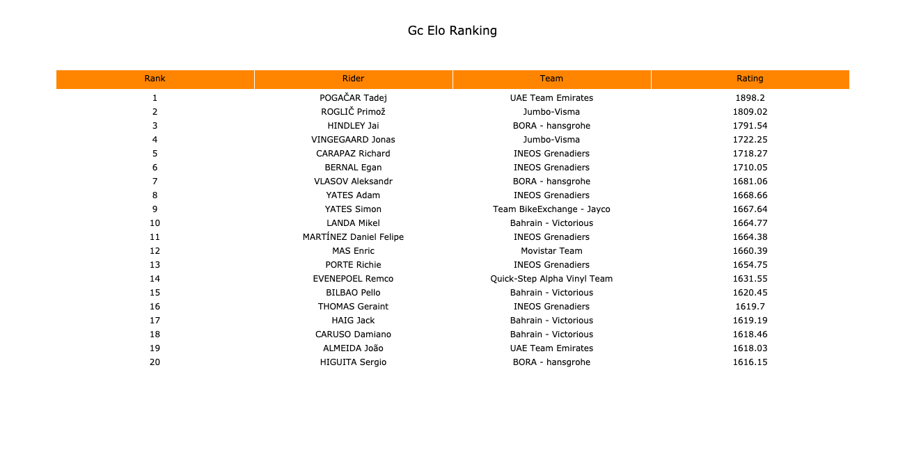
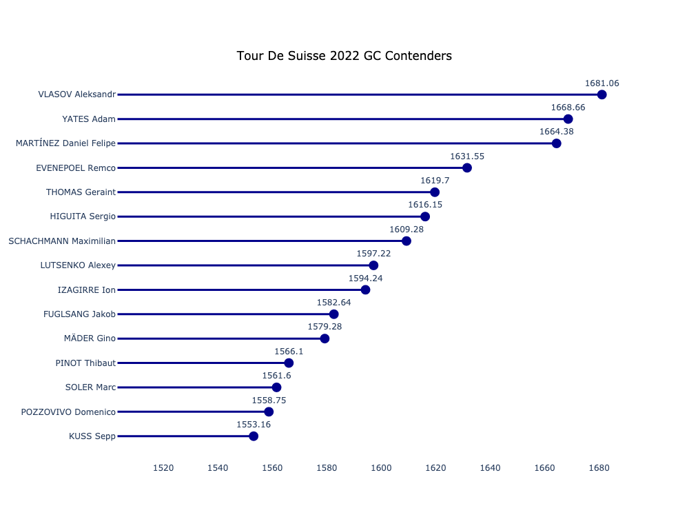

## Introducing VeloResearch cycling Elo ratings
This is my implementation of the [Elo rating system](https://en.wikipedia.org/wiki/Elo_rating_system), which was initially developed for rating chess players. An Elo rating system assigns a single numerical rating to an entity (player or team) which serves as an estimation of their ability in a given discipline. These entities can then be ranked by their Elo rating, which is effectively a ranking of entities by how ``good" they are at  that discipline. The VeloResearch Elo ratings are an application of Elo to professional cycling. I will be posting periodic updates to pro cycling Elo ratings for GC, time trialing, and sprinting to my [Twitter account](https://twitter.com/veloresearch). All data are supporting this project were taken from [ProCyclingStats](procyclingstats.com).

This project was inspired by [FiveThirtyEight's use of Elo Ratings](https://fivethirtyeight.com/features/how-we-calculate-nba-elo-ratings/) in sports such as the NFL and cycling content creators such as the Lanterne Rouge Cycling Podcast (run by Patrick Broe and Benji Naesen) but is by no means the first application of Elo Ratings to cycling. There are existing projects such as that of [Motirolo Analyses](https://mortirolo.netlify.app/) which track cycling Elo ratings for multiple disciplines, as well as Twitter accounts such as [El Tio del Dato](https://twitter.com/eltiodeldato?ref_src=twsrc%5Egoogle%7Ctwcamp%5Eserp%7Ctwgr%5Eauthor). Others, such as [Zoer Cycling Stats](https://twitter.com/ZoerCyclingStat) deal mostly with using machine learning predicting the outcomes of cycling races.

As they were initially developed for chess, the basic Elo algorithms concerns itself with 2-player games. FiveThirtyEight's version also generally follows this paradigm. To apply this system to a multiplayer game such as cycling, I treat each race as a series of head-to-head results which occur simultaneously. Most multiplayer Elo systems I have seen also do something similar. I recently came across Danny Cunningham's [generalized Elo rating system, developed for poker](https://towardsdatascience.com/developing-a-generalized-elo-rating-system-for-multiplayer-games-b9b495e87802#:~:text=In%20standard%20two%2Dplayer%20Elo,calculations%20can%20continue%20as%20normal.), which proposes an interesting approach to applying Elo to multiplayer games, and I may try his system on cycling to see how it compares to what I have come up with.

## What do the VeloResearch Elo ratings bring to the table?
Aside from a different implementation and different parameters, there are a couple of new things my Elo ratings bring to the table. My system supports ratings for GC, time trialing, and sprinting for both men's and women's cycling. Further, my system utilizes data from the last twelve years of pro cycling results, and plan to go back further. When there is a lull in contemporary cycling results, I may go back in time and release Elo ratings at certain points in years past.

Other similar projects also delve into prediction and probability using Elo ratings and other techniques. I'm not there yet, but I'm extremely interested in the possibilities there. Cycling results, particularly results for one-off races or stages, can be extremely difficult to predict. I want to find out exactly how well future cycling results can be modeled.

## Some examples
The [VeloResearch Twitter account](https://twitter.com/veloresearch) will be updated more often with up-to-date ratings for different disciplines, but here are a couple of examples of the VeloResearch Elo ratings.

First, we have the general GC picture across all of men's pro cycling as of June 10, 2022: 

Further, we have the GC Elo ratings of riders entered in the 2022 Tour de Suisse as of June 10, 2022, prior to the start of the race: 

## Technical notes
The data supporting my Elo system isn't shared in this repo at the moment, but all the code written for generating the ratings is included. I'll use this section to explain a bit how my Elo ratings work.

Note first that Elo ratings across different rating types (e.g. sprinting, GC) cannot be compared. Elo ratings are generated by a central script, elo.py, which takes arguments specifying exactly which type of ratings the use is looking for. Specifically, the script accepts arguments including the years between which the ratings should be generated, the gender, and the race type (GC, ITT, or sprinting). An example run for women's GC ratings between 2018 and 2022 would look like this: ```python elo.py 2018 2023 women gc```. The ratings.Velo module contains the main code for running the Elo system, including tracking riders included in the system, simulating a race as a series of simultaneous head-to-heads, managing inactive riders, and applying changes to rider ratings. The ratings.entities module includes classes which help track data about individual riders and races.

### Matchup weight decay
As I mention above, each individual race is treated as a series of simultaneous head-to-head results by my Elo system. However, this approach on its own presents several problems. (1) It does not assign precedence to head-to-head pairings with higher stakes. For example, this naive approach would assign the same weight to the matchup between the 10th and 11th placed riders as the matchup between the 1st and 2nd placed riders. Therefore, my system needed to differentiate between these types of matchups, and assign greater weight to the matchup between the 1st and 2nd placed finishers. (2a) This naive system would overweight races which have more people on the startlist (e.g. the winner of a race with 130 finishers would get more points than the winner of a race with 100 finishers, even if the race with 100 finishers had a stronger field). (2b) My system needed a way to assign greater weight to the biggest, most competitve races than the smaller races. The naive system would not do that.

<b> The solution I developed for the problem I enumerate above is as follows. </b> It is important to note that Elo systems contain a parameter K, which effectively denotes the weight assigned to a given matchup. To weight races such as the Tour de France (the biggest cycling race in the world) higher than smaller races, I assign a larger starting K to Tour de France matchups. Further, I needed to model the decreasing importance of matchups within a race as they get further and further from the win. This is the phenomenon where the matchup between the 1st and 2nd riders is ``more important" than the matchup between the 10th and 11th. To account for this, I introduced ``alpha decay", which decreases the weight assigned to a matchup according to an expontial function. Another factor I needed to account for was the lesser importance of the matchup of the 1st and 10th compared to the matchup of the 1st and 2nd riders. I introduce ``beta decay" to address this. Beta decay is very similar to alpha decay, with the difference being that the alpha decay depends on the finishing place of the better placed rider in a matchup, and beta decay takes the difference between rider finishing positions as its parameter. Together, alpha decay and beta decay also address the problem of races with larger number of finishers being overweighted.

### Rider rating regression between seasons
This is a concept taken from FiveThirtyEight. It is the notion that rider abilities become more uncertain in the offseason (prior to the start of a new season) due to factors such as aging (for older riders), development (for younger riders), team changes, injury, etc. Thus, at the beginning of each season, rider ratings for all rating typers regress to the ``mean" Elo rating of 1500. The degree to which this regression is appropriate is different for different types of ratings, and thus is a parameter that can be set in each of the files in data/settings.

## Settings and parameters
In the data/settings directory, you will find json files containing set parameters for each gender/race type combination. These parameters include factors such as the alpha and beta decays specific to that rating type, in addition to parameters such as the regression factor of ratings between seasons.
